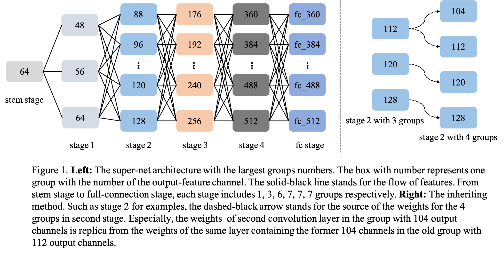

## CVPR2022 NAS competition Track 1 4th solution

Brought to you by **We NAS** from **Kaiyu Zhang**,**Jiawei Liu**,**Weitai Hu** from **Du Xiaoman Financial**

**Team Member**: Weitai Hu (胡伟泰) (**Leader**), Kaiyu Zhang (张凯昱), Jiawei Liu (刘嘉炜)

**maintainer**:[liujiawei2333](https://github.com/liujiawei2333)，[nick](https://github.com/nick-zoo)

Please follow [readme.ipynb](https://github.com/MetaLearners/Solution-to-CVPR2021-NAS-competition-Track-1/blob/main/readme.ipynb) to reproduce the results.

Note: All Python files must be run under DistributedDataParallel.

### Table of content
- [Model Construction and Optimization](#I)
- [Train standalone](#II)
- [Train one-shot supernet](#III)
- [Train few-shot supernet](#IV)
- [Evaluate](#V)

### <a id="I">Part I. Model Construction and Optimization </a>

To improve the ability of supernet in evaluating the performance of subnets, we construct two models for training, following the one-shot way and few shot way respectively. 

- model construction
  For the one-shot model, we build the architecture of supernet according to the BigNAS. For the few shot model, we extend the number of group for every stage in supernet (each stage in one-shot model only have one group). For each group in the same stage of few shot model, there are different channel numbers in the second convolution layer in the resnet-block. The left of the Figure 1 shows the archtecture of the few shot supernet.
- model optimization
  We follow the trainging strategy of BigNAS for the one-shot supernet. For the trainging of few shot supernet, we extend the number of group for every stage from 2 to the maximum (the maximum is the number of channel condidate in every stage). For the supernet with the larger group, its weights inherit from the ones of the supernet with the smaller group. Following the trainging strategy of BigNAS again, we train the few shot model sequentially along with the increase of the number of group. The right of the figue 1 shows the inheriting method.



### <a id="II">Part II. Train standalone </a>

Before training supernet, we need to prepare dataset under `./data` folder. Please first download the ImageNet dataset and move it to `./data/`. There includes three textual document under `./data`, named `train.txt`, `valid.txt` and `valid_part2500.txt`, which contain the restive path of images and the corresponding labels. The third textual document is used as the valid datasets to get the accuracy of 30 subnets. Before use the aforementioned textual documents, please change the restive image paths to the absolute ones according to your local environment.

Then, we need to import the necessary modules.

This part is not required, and its purpose is to generate the accuracy of 30 subnets trained standalone. If you don't want to repeat this step, use `./json_file/gt_arch30.json` directly.

In the subsequent training supernet, we will evaluate the accuracy of these 30 subnets and calculate kendall tau  with `./json_file/ gt_arch30. json` in the evaluate stage after each epoch, as a reference to select the best sueprnet model in this stage. Although this coefficient will not match the score coefficient on the competition website, it can serve as a rough screening model.

The basis of model selection: the model with the later epoch and the largest Kendall tau.

Note: Due to cost constraints, we only used 2500 test data to standalone train 30 subnets. As a comparison, there are 45,000 subnet pools to be evaluated on the competition website and 50000 test data, which leads to certain differences in Kendall tau.

PS:The value of target_arch_num is an integer ranging from 1 to 30.

```python
python train_stand_alone.py --target_arch_num=1
```

### <a id="III">Part III. Train one-shot supernet </a>

We first train one-shot supernet, and we need to change several parameters in `./configs/common.yml` and `./configs/train_supernet_models.yml`:

`./configs/common.yml`:

`save`: Directory to save files (models, logs, etc.)

`./configs/train_supernet_models.yml`:

`warmup_epochs`: 5

`epochs`: 100

```python
python train_supernet.py
```

### <a id="IV">Part IV. Train few-shot supernet </a>

Training few-shot spernet is divided into 6 stages, which are controlled by group_nums(2,3,4,5,6), and we need to change several parameters in `./configs/train_supernet_models.yml`:

`warmup_epochs`:0

`epochs`:20

#### group_nums = 2

`pretrained_path`: The best supernet model selected from train one-shot supernet part.

```python
python train_few_shot.py --group_nums=2 --pretrained_path='./results/save/supernet.pth'
```

#### group_nums = 3

`resumed_split_group`:supernet inherited from group_num=resumed_split_group.

`pretrained_path`:The best supernet model selected from train few-shot supernet part when group_num=resumed_split_group.

```python
python train_few_shot.py ---group_nums=3 --resumed_split_groups=2 --split_model_path='./results/save/2/supernet.pth'
```

When group_nums is greater than 3, the meanings of parameters to be set are similar to those when group_nums is 3.

#### group_nums = 4

```python
python train_few_shot.py ---group_nums=4 --resumed_split_groups=3 --split_model_path='./results/save/3_from_2/supernet.pth'
```

#### group_nums = 6

```python
python train_few_shot.py ---group_nums=6 --resumed_split_groups=5 --split_model_path='./results/save/5_from_4/supernet.pth'
```

#### group_nums = 7

```python
python train_few_shot.py ---group_nums=7 --resumed_split_groups=6 --split_model_path='./results/save/6_from_5/supernet.pth'
```

### <a id="V">Part V. Evaluate </a>

Testing 45,000 subnets is time consuming, so we split all subnets into eight equal portions, see `./json_file/json8/`, and then tested them in eight rounds.

We need to change several parameters in `test.py`.

`json_part`: 1,2,3,4,5,6,7,8,represent eight shared subnet files.

`model_name`: Name of the supernet to be evaluated.

`epoch`: Which epoch the supernet to be evaluated is stored in.

`save`: Target fold.

`test_set`: If taest_set=1, all the 50000 test sets in table are used; if test_set=0, only a small part of test sets are used (test_set=0 in the early stage to speed up the evaluation part, and 'test_set=1' in the later stage).

`split_group`: At which `group_nums` the supernet to be evaluated is trained and saved.

```python
python test.py --json_part=1 --model_name='0.81_17' --epoch=17 --save='./save' --test_set=1 --split_group=2
```

After the 8 evaluate steps are complete, we merge the 8 generated json files.

We need to change several parameters in `merge.py`.

`save`: target fold.

`epoch`: Which epoch the supernet to be evaluated is stored in. If you use all test sets, add `_all_test` suffix.

`stage`: `'2'` or `'3_from_2'` or `'4_from_3'` or `'5_from_4'` or `'6_from_5'` or `'7_from_6'`.

`top`:1 or 5,the default is 1.

```python
python merge.py --save='./save' --epoch='17_all_test' --stage='3_from_2' --top=1
```

```python
'''Final evaluate file'''
final_file = './results/'+str(save)+'/'+str(stage)+'/json_results/'+'epoch/'+str(epoch_all_test)+'/top1_json_final.json'
```

Our highest-scoring prediction files are located in `./results/save/6_fom_5/json_results/epoch/4_all_test/top1_json_final.json`, corresponding to 0.8183 on Leaderboard A and 0.80599 on Leaderboard B.

Corresponding to the download address of the supernet file:

url: [supernet file](https://pan.baidu.com/s/17XNT--5vrbe3dDmZAxZAtw)

Extract the code: bir0

Please place the model files under directory `./results/save/6_fom_5/`.